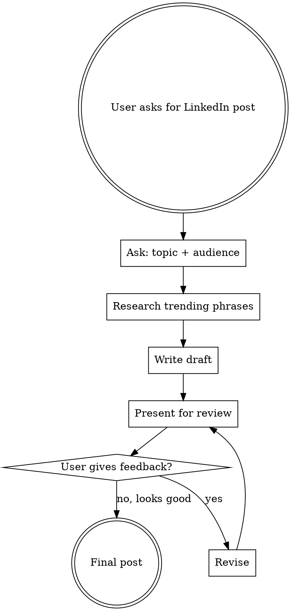

# Writing LinkedIn Posts

## Overview

Write LinkedIn posts that sound like a real human typed them on their phone, not like an AI content mill. Research current trending phrases, use a conversational storytelling tone, and keep it punchy.

**Core principle:** If it sounds like it could come from any LinkedIn influencer, it's too generic. Good posts have a specific voice, a real moment, and language people actually use.

## When to Use

- User wants to write or draft a LinkedIn post
- User wants to improve an existing LinkedIn post
- User asks for help with LinkedIn content or engagement
- User wants to sound more human/authentic on LinkedIn

## Workflow

### Step 1: Ask About Topic and Audience

Before writing anything, ask the user:
- **What's the topic or moment?** (a story, insight, opinion, lesson)
- **Who's the audience?** (developers, engineering managers, tech recruiters, startup founders)

Do NOT ask more than these two questions. Keep it lightweight.

### Step 2: Research Trending Phrases

Use `WebSearch` to find:
- Current trending LinkedIn hashtags in their topic area
- Viral post patterns and hooks that are working right now
- Trending phrases and language in the tech LinkedIn space

Search queries to use:
- `"LinkedIn trending hashtags [topic] [current month year]"`
- `"viral LinkedIn posts [topic] [current month year]"`
- `"LinkedIn engagement tips [current month year]"`

Extract 3-5 trending hashtags and 2-3 current phrases/hooks to weave into the post.

### Step 3: Write the Draft

Follow ALL of these rules:

#### Length
- **150-250 words max.** No exceptions.
- Short paragraphs (1-2 sentences each)
- Use line breaks aggressively — LinkedIn rewards white space

#### Hook (First Line)
The first line must stop the scroll. Patterns that work:
- **Contrarian take:** "Nobody talks about the worst part of getting promoted."
- **Specific moment:** "Last Tuesday, my deploy broke prod at 11pm."
- **Bold statement:** "I mass 90% of code reviews are a waste of time."
- **Question:** "Why do we still mass a CS degree means you can code?"

Do NOT start with: "I'm excited to share..." / "Thrilled to announce..." / "Here's something interesting..."

#### Tone and Voice
- Write like you're texting a smart friend, not writing an essay
- Use contractions (don't, can't, won't, it's)
- Short sentences. Fragments are fine. Like this.
- Swear mildly if it fits (damn, hell) — it signals authenticity
- Include one imperfect moment (typo-level casualness, self-deprecation)
- Use "you" and "I" — make it personal

#### BANNED Words and Phrases (AI Slop)
NEVER use these — they instantly signal AI-generated content:

| Banned | Use Instead |
|--------|-------------|
| leverage | use |
| utilize | use |
| delve | dig into |
| comprehensive | full / complete |
| cutting-edge | new / latest |
| synergy | (just don't) |
| passionate about | love / care about |
| thought leader | (never say this about yourself) |
| ecosystem | space / world |
| paradigm shift | big change |
| innovative | new / clever |
| revolutionize | change / shake up |
| empower | help |
| streamline | simplify |
| robust | solid / strong |
| seamless | smooth |
| game-changer | (skip it) |
| deep dive | look into / dig into |
| at the end of the day | (just delete it) |
| in today's fast-paced world | (delete this immediately) |
| it's not about X, it's about Y | (overused LinkedIn formula) |
| let that sink in | (cringe) |
| unpopular opinion | (rarely actually unpopular) |
| hot take | (unless it's actually hot) |
| this is the way | (dead meme) |
| disciplined problem-solving | (corporate speak) |
| That hit different | (overused) |
| Here's the thing | (LinkedIn cliche opener) |
| nobody tells you | (overused framing) |
| let me explain | (condescending) |
| read that again | (cringe) |
| I'll say it louder | (performative) |

#### Story Structure
Don't write a perfect hero's journey. Real stories are messy:
- Start in the middle of the action, not with backstory
- Include the awkward/embarrassing part
- The lesson should feel discovered, not preached
- End with an observation, not a lecture

#### Engagement Ending
Do NOT end with generic questions like "What do you think?" or "What's your experience?"

Instead:
- End with a specific, answerable question tied to your story
- OR end with a bold statement that invites disagreement
- OR just... end. Not every post needs a CTA.

#### Hashtags
- Use 3-5 hashtags max
- Place them at the very end, separated from the post
- Mix trending hashtags (from research) with niche ones
- Never use more than one broad hashtag (#Tech, #Leadership)

### Step 4: Present and Revise

Show the draft to the user. Ask:
> "Here's the draft. Want me to adjust the tone, length, or angle?"

Revise based on feedback. Maximum 2-3 revision rounds before finalizing.

## Quick Reference

| Element | Rule |
|---------|------|
| Length | 150-250 words |
| Hook | First line must stop the scroll |
| Tone | Texting a smart friend |
| Paragraphs | 1-2 sentences, lots of white space |
| Hashtags | 3-5 trending + niche, at the end |
| Banned words | See table above — zero tolerance |
| Story | Start in the middle, include the messy part |
| Ending | Specific question or bold statement, no generic CTAs |
| Emoji | 0-2 max, only if natural |

## Common Mistakes

| Mistake | Fix |
|---------|-----|
| Writing 400+ words | Cut ruthlessly. If it's not essential, delete it. |
| Perfect narrative arc | Add the awkward part. What went wrong? |
| Generic hashtags | Research current trending ones first |
| "What do you think?" ending | Ask something specific or just stop |
| Starting with "I'm excited to..." | Start with a hook that creates curiosity |
| Using AI-slop words | Check against the banned list before finalizing |
| Skipping trend research | Always search — trends change weekly |
| Too many hashtags | 3-5 max, mostly niche |
